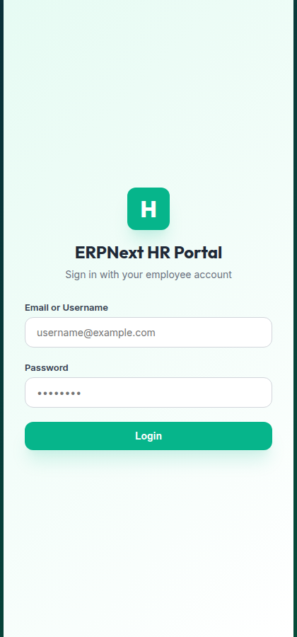
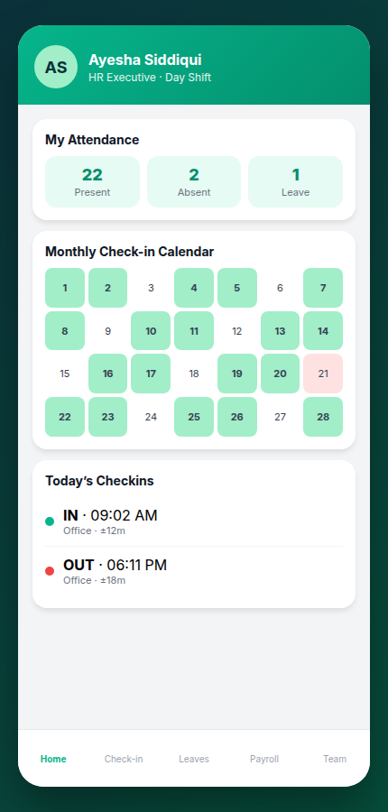
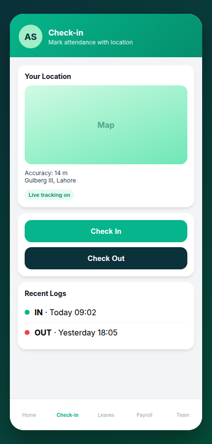
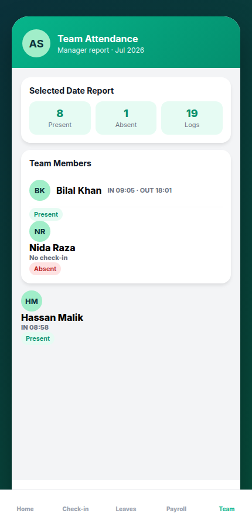

# HR Mobile App

Mobile HR portal for ERPNext / Frappe HR — employee check-in with geolocation, attendance calendar, leaves, payroll, and manager team reports.

Open the app at: `/hr_app`

## Screenshots

| Login | Home |
| --- | --- |
|  |  |

| Check-in | Team |
| --- | --- |
|  |  |

## Requirements

- [Frappe Bench](https://github.com/frappe/bench)
- ERPNext + [Frappe HR (hrms)](https://github.com/frappe/hrms)

## Installation (new site)

Example using bench path `/home/frappe/frappe-bench` and site `site1.local`:

```bash
cd /home/frappe/frappe-bench
bench get-app https://github.com/ERPNEXT-PAKISTAN/HR-Mobile-App.git --branch main
bench --site site1.local install-app hr_mobile_app
bench --site site1.local clear-cache
bench restart
```

Generic form:

```bash
cd $PATH_TO_YOUR_BENCH
bench get-app $URL_OF_THIS_REPO --branch main
bench --site site1.local install-app hr_mobile_app
```

Then open:

```text
http://site1.local:8000/hr_app
```

(or your site URL + `/hr_app`)

## Update (app already installed)

If the server already has `hr_mobile_app` installed, pull the latest code and migrate:

```bash
cd /home/frappe/frappe-bench
bench update --pull --apps hr_mobile_app
bench --site site1.local migrate
bench build --app hr_mobile_app
bench --site site1.local clear-cache
bench restart
```

Or update only this app with git:

```bash
cd /home/frappe/frappe-bench/apps/hr_mobile_app
git pull origin main

cd /home/frappe/frappe-bench
bench --site site1.local migrate
bench build --app hr_mobile_app
bench --site site1.local clear-cache
bench restart
```

> **Note:** If gunicorn is started with `--preload`, a full `bench restart` (or restarting the gunicorn workers) is required after API changes. A soft reload alone can leave old code in memory.

## Features

- Employee login and profile photo
- Check-in / check-out with GPS accuracy and address
- Today’s check-in list and monthly attendance calendar
- Leave balance, apply leave, and approvals (managers)
- Salary slip view
- Manager team attendance board, date/month reports, and live map

## Contributing

This app uses `pre-commit` for code formatting and linting. Please [install pre-commit](https://pre-commit.com/#installation) and enable it for this repository:

```bash
cd /home/frappe/frappe-bench/apps/hr_mobile_app
pre-commit install
```

Pre-commit is configured to use:

- ruff
- eslint
- prettier
- pyupgrade

## License

mit
